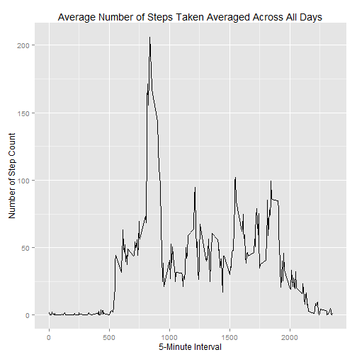

<H2>Reproducible Research - Project 1</H1>
<p><b>Tracy Wilson</b></br>
Saturday, April 18, 2015</p>


<h3>Introduction</h3>

<p>It is now possible to collect a large amount of data about personal movement using activity monitoring devices such as a Fitbit, Nike Fuelband, or Jawbone Up. These type of devices are part of the "quantified self" movement - a group of enthusiasts who take measurements about themselves regularly to improve their health, to find patterns in their behavior, or because they are tech geeks. But these data remain under-utilized both because the raw data are hard to obtain and there is a lack of statistical methods and software for processing and interpreting the data.</p>

<p>This assignment makes use of data from a personal activity monitoring device. This device collects data at 5 minute intervals through out the day. The data consists of two months of data from an anonymous individual collected during the months of October and November, 2012 and include the number of steps taken in 5 minute intervals each day.</p>

<h3>Data</h3>

<p>Dataset: Activity monitoring data [52K]</p>

<p>The variables included in this dataset are:</p>

<ul>
<li>steps: Number of steps taking in a 5-minute interval (missing values are coded as NA)</li>
<li>date: The date on which the measurement was taken in YYYY-MM-DD format</li>
<li>interval: Identifier for the 5-minute interval in which measurement was taken</li>
</ul>

<p>The dataset is stored in a comma-separated-value (CSV) file and there are a total of 17,568 observations in this dataset.</p>

<h3>Assignment</h3>

<b>Basic settings</b>

```r
library(knitr)
echo = TRUE  # so that someone else will be able to read the code
options(scipen = 1)  # Turn off scientific notations
```

<b>Load libraries</b>

```r
library(plyr)
library(ggplot2)
library(Hmisc)
```

```
## Loading required package: grid
## Loading required package: lattice
## Loading required package: survival
## Loading required package: Formula
## 
## Attaching package: 'Hmisc'
## 
## The following objects are masked from 'package:plyr':
## 
##     is.discrete, summarize
## 
## The following objects are masked from 'package:base':
## 
##     format.pval, round.POSIXt, trunc.POSIXt, units
```

<h3>Loading and preprocessing the data</h3>


```r
setwd("D:/Users/Tracy/Documents/GitHub/PeerAssessment1")
ACT <- read.csv("./data/activity.csv", colClasses = c("integer", "Date", "factor"))
ACT$date <- as.Date(ACT$date,format = '%Y-%m-%d')
ACT.ignore.na <- na.omit(ACT)
rownames(ACT) <- 1:nrow(ACT)

ACT_Totals <-aggregate(steps~date, data=ACT,sum, na.rm=TRUE)
colnames(ACT_Totals) <- c("date", "steps")
head(ACT_Totals)
```

```
##         date steps
## 1 2012-10-02   126
## 2 2012-10-03 11352
## 3 2012-10-04 12116
## 4 2012-10-05 13294
## 5 2012-10-06 15420
## 6 2012-10-07 11015
```

```r
dim(ACT_Totals)
```

```
## [1] 53  2
```

<p><b>What is total number of steps taken per day?</b></p>


```r
StepsTotalperDay <- aggregate(steps ~ date, data = ACT, sum, na.rm = TRUE)
```


<p><b>Make a histogram of the total number of steps taken each day</b></p>


```r
ggplot(StepsTotalperDay, aes(x = steps)) + 
       geom_histogram(fill = "gray", binwidth = 1000) + 
        labs(title="Histogram of Steps Taken per Day", 
             x = "Total Number of Steps Taken Daily", y = "Number of times in a day(Count)") + theme_bw() 
```

 

<p><b>What is mean total number of steps taken per day?</b></p>


```r
mean(ACT_Totals$steps)
```

```
## [1] 10766.19
```

```r
median(ACT_Totals$steps)
```

```
## [1] 10765
```

The mean is <b>10766.1886792</b> and the median is <b>10765</b>


<p><b>What is the average daily activity pattern?</b></p>

<p>To make a time series plot (i.e. type = "l") of the 5-minute interval (x-axis) and the average number of steps taken, averaged across all days (y-axis) we will calculate the aggregate of steps by 5 minutes intervals.</p>


```r
StepsPerInterval <- aggregate(ACT$steps, by = list(interval = ACT$interval), FUN=mean, na.rm=TRUE)
StepsPerInterval$interval <- as.integer(levels(StepsPerInterval$interval) [StepsPerInterval$interval])
colnames(StepsPerInterval) <- c("interval", "steps")
head(StepsPerInterval)
```

```
##   interval      steps
## 1        0  1.7169811
## 2       10  0.1320755
## 3      100  0.3207547
## 4     1000 40.5660377
## 5     1005 26.9811321
## 6     1010 42.4150943
```

<p>Plot the time series</p>


```r
qplot(x=interval, y=steps, data = StepsPerInterval,  geom = "line",
      xlab="5-Minute Interval",
      ylab="Number of Step Count",
      main="Average Number of Steps Taken Averaged Across All Days"
      )
```

 

<p>Which 5-minute interval, on average across all the days in the dataset, contains the maximum number of steps?</b>


```r
MaximumInterval <- StepsPerInterval[which.max(StepsPerInterval$steps),]
```

The <b>835</b> interval has the maximum steps:  <b>206.1698113</b>.


<h3>Imputing missing values</h3>

<p>Calculate and report the total number of missing values in the dataset (i.e. the total number of rows with NAs)</p>


```r
MissingValues <- sum(is.na(ACT$steps))
```

The total number of missing values is: <b>2304</b> 

<p>Strategy for filling in all of the missing values in the dataset.  The first step is to calculate the mean of the steps for each interval.  Once this has been calculated, substitute the mean for each interval for any values of NA joined by the interval</p>

<p><b>Make a histogram of the total number of steps taken each day</b></p>

<p>Create a new dataset that is equal to the original dataset but with the missing data filled in.</p>


```r
ACTDataImputed <- ACT
ACTDataImputed$steps <- impute(ACT$steps, fun=mean)
totalStepsByDayImputed <- tapply(ACTDataImputed$steps, ACTDataImputed$date, sum)
qplot(totalStepsByDayImputed, xlab='Total steps per day (Imputed)', ylab='Frequency using binwith 500', binwidth=500)
```

 


<p>Calculate and report the mean and median total number of steps taken per day.</p>


```r
mean(totalStepsByDayImputed, na.rm=TRUE)
```

```
## [1] 10766.19
```

```r
median(totalStepsByDayImputed, na.rm=TRUE)
```

```
## [1] 10766.19
```

<p>The median values differ slightly while the mean remains the same.  The impact is not great.</p>

<ul>
  <li>Before filling the data</li>
      Mean: 10766.1886792  
      Median: 10765
  <li>After filling the data</li>
      Mean: 10766.1886792  
      Median: 10766.1886792
</ul>


<p><b>Are there differences in activity patterns between weekdays and weekends?</b></p>

<p>First we will create a new factor variable in the dataset with two levels - "weekday" and "weekend" indicating whether a given date is a weekday or weekend day.</p>


```r
weekdays_steps <- function(ACT) {
    weekdays_steps <- aggregate(ACT$steps, by=list(interval = ACT$interval),
                          FUN=mean, na.rm=T)
    # convert to integers for plotting
    weekdays_steps$interval <- 
            as.integer(levels(weekdays_steps$interval)[weekdays_steps$interval])
    colnames(weekdays_steps) <- c("interval", "steps")
    weekdays_steps
}

data_by_weekdays <- function(ACT) {
    ACT$weekday <- 
            as.factor(weekdays(ACT$date)) # weekdays
    weekend_data <- subset(ACT, weekday %in% c("Saturday","Sunday"))
    weekday_data <- subset(ACT, !weekday %in% c("Saturday","Sunday"))

    weekend_steps <- weekdays_steps(weekend_data)
    weekday_steps <- weekdays_steps(weekday_data)

    weekend_steps$dayofweek <- rep("weekend", nrow(weekend_steps))
    weekday_steps$dayofweek <- rep("weekday", nrow(weekday_steps))

    data_by_weekdays <- rbind(weekend_steps, weekday_steps)
    data_by_weekdays$dayofweek <- as.factor(data_by_weekdays$dayofweek)
    data_by_weekdays
}

data_weekdays <- data_by_weekdays(ACTDataImputed)
```

<p>Make a panel plot containing a time series plot (i.e. type = "l") of the 5-minute interval (x-axis) and the average number of steps taken, averaged across all weekday days or weekend days (y-axis).</p>


```r
qplot(x=interval, y=steps, data = data_weekdays,  geom = c("line"), facets = dayofweek~.,
      xlab="5-Minute Interval",
      ylab="Number of Steps Count",
      main="Comparison of weekday vs. Weekend Activity"
      )
```

 

<p>The level of activity sees a rather large spike during the weekdays.  While it is more evenly distributed during the weekend.  This could be for various reason, but a plausible explanation is that during the week periods of higher activity occur during specific times, such as gym time.</p>
